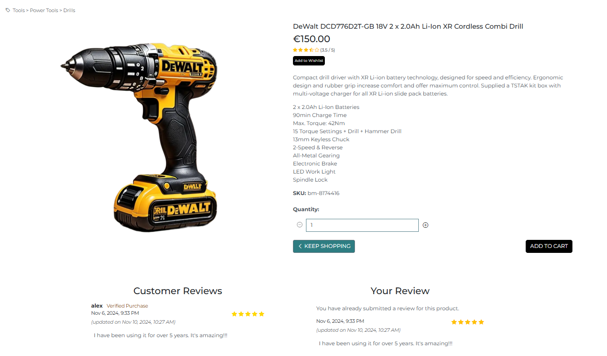

# Build Master Shop

Build Master Shop is a full-featured e-commerce web application specializing in the sale of tools and workwear. Built with Django, this project demonstrates a modern, responsive shopping platform with a user-friendly interface for browsing, selecting, and purchasing products.

### [Link to the Build Master live website](https://build-master-shop-84761d123763.herokuapp.com/)

## Table of Contents

- [Overview](#overview)
- [Agile Methodology](#agile-methodology)
- [UX](#ux)
   * [Strategy](#strategy)
   * [Scope](#scope)
   * [Structure](#structure)
   * [Skeleton](#skeleton)
   * [Surface](#surface)
- [Ecommerce Business Model](#ecommerce-business-model)
- [Search Engine Optimization (SEO)](#search-engine-optimization-seo)
   * [Keywords](#keywords)
   * [Sitemap](#sitemap)
   * [Robots](#robots)
- [Web Marketing](#web-marketing)
   * [Facebook Marketing](#facebook-marketing)
   * [Content Strategy](#content-strategy)
   * [Newsletter Marketing](#newsletter-marketing)
- [Existing Features](#existing-features)
   * [Account Management](#account-management)
   * [CRUD Functionality](#crud-functionality)
   * [Responsive Navbar](#responsive-navbar)
   * [Footer](#footer)
   * [Home Page](#home-page)
   * [Product List](#product-list)
   * [Product Detail](#product-detail)
   * [Shopping Cart](#shopping-cart)
   * [Checkout Page](#checkout-page)
   * [Blog Feature](#blog-feature)
   * [My Profile Page](#my-profile-page)
   * [Wishlist Page](#wishlist-page)
   * [Product Rating and Review System](#product-rating-and-review-system)
   * [Stock Availability Check](#stock-availability-check)
   * [User Notifications](#user-notifications)
- [Features Left to Implement](#features-left-to-implement)
- [Django Admin Portal](#django-admin-portal)
- [Technologies](#technologies)
- [Testing](#testing)
- [Deployment](#deployment)
   * [Activate Your Gitpod Enterprise Account](#activate-your-gitpod-enterprise-account)
   * [Create a New Workspace](#create-a-new-workspace)
   * [Pre-Deployment](#pre-deployment)
   * [Deploying on Heroku](#deploying-on-heroku)
   * [Post-Deployment](#post-deployment)
   * [Amazon AWS](#amazon-aws)
   * [Stripe Settings](#stripe-settings)
   * [GMAIL Settings](#gmail-settings)
- [Credits](#credits)
   * [Media](#media)
   * [Content and Resources](#content-and-resources)
   * [Debugging Issues](#debugging-issues)

## Overview
Build Master Shop is a web application developed using Django, designed as an online store specializing in tools and workwear. The platform allows users to browse a comprehensive selection of high-quality tools and workwear, add items to their cart, and complete purchases with ease. This project was created as part of my portfolio to showcase my proficiency in e-commerce web development.

#### First-Time User
- Tool Seeker: A user looking for specific tools or workwear, whether for professional or personal use, who values reliable and high-quality products.
- Information Seeker: A customer who wants detailed information about tools and workwear, including product descriptions, prices, and specifications.
- Online Shopper: A user who prefers the convenience of online shopping, allowing them to explore products and complete purchases from home.

#### Returning User
- Order History Reviewer: A returning customer who wants to view past purchases for record-keeping or reordering.
- Quick Buyer: A returning user with an account who wishes to make purchases efficiently, without having to re-enter their information.
- New Arrivals Explorer: A returning customer who checks the site regularly to discover the latest tools, workwear, and promotions.

[Back To Top](#table-of-contents)

## Agile Methodology
This project followed Agile principles, utilizing GitHub Issues to document and manage User Stories effectively. Each User Story was associated with clear Acceptance Criteria and broken down into smaller tasks, which allowed for flexible adjustments and ensured that the development process stayed aligned with project goals. You can view the issues for this project [here](https://github.com/OleksiiKova/build_master_shop/issues).

A Kanban Board was employed to visualize and streamline the workflow, using columns such as Backlog, To Do, In Progress, and Done. This structure provided a straightforward way to track task progress and adjust priorities as needed. The board layout supported a flexible, iterative approach, making it easier to implement new features and address feedback throughout development.

[Kanban view](https://github.com/users/OleksiiKova/projects/4/views/1)

Click to view a screenshot of the Kanban view

  
In addition to the Kanban Board, GitHub's Table view was used for a more organized, high-level overview of the project. This view allowed me to see all tasks, priorities, and their statuses at a glance, ensuring efficient planning and resource allocation.

[Table view](https://github.com/users/OleksiiKova/projects/4/views/4)

Click to view a screenshot of the Table view

  
I structured the project around Epics and User Stories, dividing the development into manageable chunks. Each Epic corresponded to a core feature of the "Build Master Shop" platform, such as user management, card and orders, or reviews and rating. This structure ensured that each feature was user-centric and aligned with real-world needs.

#### Epics:
1. [EPIC: Product Management](https://github.com/OleksiiKova/build_master_shop/issues/7)
2. [EPIC: User Management](https://github.com/OleksiiKova/build_master_shop/issues/3)
3. [EPIC: Reviews & Ratings](https://github.com/OleksiiKova/build_master_shop/issues/19)
4. [EPIC: Customer Support](https://github.com/OleksiiKova/build_master_shop/issues/25)
5. [EPIC: Cart & Orders](https://github.com/OleksiiKova/build_master_shop/issues/14)

The MoSCoW Method of Prioritization was employed to categorize each User Story into Must Have, Should Have, or Could Have priorities. Some features were labeled as Won't Have and deferred to the Backlog for potential future development. This approach helped to maintain a strong focus on the Minimum Viable Product (MVP), ensuring that essential features, such as product catalog browsing, user authentication, and checkout, were prioritized.

Overall, implementing Agile Methodology, combined with the MoSCoW prioritization technique, proved highly effective. This approach kept development organized and facilitated better time management by ensuring that the most valuable features were addressed first. While I did not set rigid timeframes for each iteration, moving tasks from To Do to Done was both motivating and provided a tangible sense of progress.

[Back To Top](#table-of-contents)

## UX

### Strategy
Build Master Shop aims to deliver a seamless and enjoyable shopping experience for customers seeking high-quality tools and workwear. The website’s primary features include a comprehensive product catalog, easy-to-navigate categories, and a streamlined checkout process. Additionally, the site highlights the brand's commitment to quality and customer satisfaction, with detailed product descriptions and usage guides for each item. A "Why Choose Us" section emphasizes the advantages of purchasing through Build Master Shop, building trust with customers and setting the brand apart in the market.

### Scope
Functional Specifications: Key functionalities include user registration and authentication, product inventory management by administrators, a personalized profile for customers, and a shopping cart for managing selected products. Customers can search, filter, and sort through the product catalog to find specific items, with options to read and leave product reviews. Additional features include viewing order history, tracking current orders, and accessing customer support for inquiries or assistance with purchases.

Content Requirements: Engaging content will include product descriptions, usage tips, brand information to help customers make informed purchasing decisions. Each product listing will contain detailed specifications, designed to support both professionals and DIY enthusiasts in selecting the right tools and workwear.

### Structure
The site structure is designed to guide users intuitively from browsing products to completing purchases. The information architecture is organized to provide a logical and seamless user flow, with easily accessible pages for the home, product categories, cart, and checkout, enhancing overall usability.

The navbar displays the Build Master Shop logo consistently across all pages and devices, reinforcing brand identity. Optimized for mobile users, the navbar features a responsive toggler that collapses the menu for a cleaner view on smaller screens. Links to essential pages, including Home and Products Categories are prominently displayed. For logged-in users, a profile icon provides access to personalized options such as my profile (include default delivery information and order history), my reviews, and my wishlist. New visitors or users not yet signed in will see links to Login and Register, ensuring a smooth onboarding experience.

Call to Action (CTA) Placement: Key CTAs are strategically placed to drive conversions. For instance, on the Home page, the "Shop Now" button is prominently displayed, encouraging users to begin browsing immediately. On product pages, the "Add to Cart" button is clearly highlighted to facilitate quick actions. On the blog page, the "Shop Now" button is also available, allowing readers to transition seamlessly from reading informative articles to browsing related products. This design ensures that critical CTAs are easily visible, enhancing user engagement and promoting conversions.

The footer of the Build Master Shop website offers users easy access to essential information, including contact details (phone and email), policy links, and social media channels. The Contact Information section provides users with a phone number and email address for quick support. The Stay Connected area includes a link to our Facebook page, allowing customers to stay updated and engaged with the brand on social media. For easy navigation, the Our Links section contains direct links to key pages like the Blog and Contact Us pages, giving users quick access to content and support resources. There’s also a Useful Links section, featuring external resources like the Health and Safety Authority (HSA), which provides additional industry-related information. The Policies section includes links to our Privacy Policy and Terms of Service, promoting transparency and ensuring users can conveniently access important legal information. Finally, a Subscribe form allows users to sign up for updates, offering an opportunity to stay informed about new products, promotions, and company news. This organized and informative footer supports user convenience and trust, enhancing their overall experience on the site.

### Skeleton

#### Wireframes

The website is designed to be clear and simple. To create the wireframe I used Balsamiq software. During the design phase, some elements were modified to enhance the user experience.
PDF file with my wireframe you cand find [here](static/images/readme_images/balsamiq-build-master.pdf).

#### Database structure
After deciding on the project's features, I used Lucidchart to plan the database structure. The diagram below serves as an initial guide, illustrating the types of data and their relationships.

### Surface

#### Colours

The following colour palette was used from [Coolors](https://coolors.co/):

#### Typography

- Headings: The "Montserrat" font-family is used for all heading levels to ensure a modern and clean look.
- Body Text: The default Bootstrap font settings are utilized for all other text to maintain consistency and readability across the site.

[Back To Top](#table-of-contents)

## Ecommerce Business Model

BuildMaster operates on a Business-to-Consumer (B2C) model, focusing on selling products directly to individual customers. The approach is straightforward, concentrating on single-purchase transactions without incorporating features like subscription plans at this stage.

Although still in its early stages of development, the platform already integrates tools to enhance customer engagement, such as a newsletter subscription and links to social media profiles.

### Role of Social Media
Social media platforms, particularly popular ones like Facebook, provide a powerful opportunity to connect with potential customers. By leveraging these platforms for marketing campaigns, the business can expand its reach, foster a sense of community, and drive traffic to the website.

### Role of Newsletter Marketing
The newsletter subscription feature allows the business to maintain regular communication with interested customers. Subscribers can receive updates about new products, exclusive offers, and special promotions, keeping them engaged and informed. For more details on how newsletters can enhance marketing efforts, refer to Newsletter Marketing.

[Back To Top](#table-of-contents)

## Search Engine Optimization (SEO)

### Keywords

In my work on optimizing the SEO for Build Master Shop, I focused on finding relevant and impactful keywords that align with the business's focus: tools, workwear, and safety equipment. Below is an overview of my keyword research process and findings.

#### Brainstorming Topics
I started by identifying five key categories that represent the product offerings and audience interests for Build Master Shop. These categories became the foundation for generating keyword ideas:

- Power Tools
- Hand Tools
- Workwear
- Safety Equipment
- Construction Supplies

#### Generating Keyword Ideas

Using these categories, I brainstormed keywords that potential customers might use while searching online. I focused on terms that capture both the broad and specific needs of the audience.

Click to view the list

- Power Tools:
   - Power tools for construction
   - Affordable power tools
   - Best cordless drills
   - Electric saws for woodworking
   - Heavy-duty power tools

- Hand Tools:
   - Hand tools for home repairs
   - Quality screwdriver sets
   - Hammer and wrench sets
   - Best hand tools for woodworking
   - Professional-grade hand tools

- Workwear:
   - Durable workwear
   - Work boots for construction
   - Best jackets for outdoor work
   - High-visibility workwear
   - Winter work clothes

- Safety Equipment:
   - Safety gloves for construction
   - Protective eyewear for workshops
   - Heavy-duty helmets
   - Ear protection for machinery
   - Safety vests for night work

- Construction Supplies:
   - Construction tools and equipment
   - Industrial-grade tools
   - Equipment for contractors
   - Construction gear for professionals
   - Building site essentials

#### Refining Keywords with Google Research

To refine these ideas, I ran them through Google to:

- Check Autocomplete suggestions—these show popular related queries.
- Review Related Searches at the bottom of the search results.
- Analyze competitor keywords by looking at top-ranking websites and ads.

For example, searching "best cordless drills" revealed related searches like "cordless drills for woodworking" and "top-rated cordless drills for contractors," which I added to the list.

#### Short-Tail and Long-Tail Keywords

I curated a mix of short-tail (general) and long-tail (specific) keywords to target a broad and niche audience:

##### Short-Tail Keywords:
- Power tools
- Hand tools
- Workwear
- Safety equipment
- Construction gear

##### Long-Tail Keywords:
- high-quality power tools
- Best cordless drills for woodworking
- comfortable workwear built for outdoor jobs
- Safety vests with reflective strips
- Top hand tools for home repairs
- High-visibility clothing for road workers
- Reliable safety equipment

#### Evaluating Keywords for Relevance and Authority

I evaluated the keywords for:

Relevance: Ensuring they directly relate to Build Master Shop’s offerings.
Authority: Checking whether they align with the site's credibility as a tools and workwear specialist.

I used tools like Google Keyword Planner and Ahrefs to confirm:

Search Volume: Choosing keywords with enough interest to attract traffic.
Competition Level: Prioritizing keywords with moderate competition to balance visibility and ranking potential.

#### Documenting the Process

This structured approach ensures that my keyword strategy is aligned with the target audience's needs. By tracking and updating the keywords regularly, I can adapt to trends and improve SEO performance.

This process not only supports attracting relevant traffic but also sets the foundation for social media marketing, product listing optimization, and future content strategies.

### Sitemap

An XML sitemap has been created using tools like [XML-Sitemaps](https://www.xml-sitemaps.com), which automatically crawls the entire website and generates a complete sitemap. The sitemap provides search engines with a structured overview of the website’s pages, improving indexing.

The sitemap is available here: [sitemap.xml](sitemap.xml)

### Robots

A [robots.txt](robots.txt) file has been configured at the root level of the project to guide search engine crawlers. This file includes specific rules to restrict access to sensitive pages like the checkout process and administrative areas, while also linking to the site’s sitemap for proper indexing.

[Back To Top](#table-of-contents)

## Web Marketing

To enhance the visibility and reach of Build Master Shop, I have implemented a focused web marketing strategy. The main emphasis is on leveraging social media platforms, primarily Facebook, to engage with customers and build a community around the brand.

### Facebook Marketing

I created a dedicated [Facebook page](https://www.facebook.com/p/build-master-61568320523905/) for Build Master Shop, which serves as a hub for:

- Sharing product updates, promotions, and new arrivals.
- Posting engaging content like tips for tool usage, safety guidelines, and project inspiration.
- Interacting with customers through comments, messages, and community discussions.
- Running targeted ad campaigns to reach users interested in tools, workwear, and safety equipment.

By focusing on these, BuildMaster will effectively utilize Facebook to enhance brand visibility, engage with readers, and drive traffic to its online store.

Facebook page

### Content Strategy

My content strategy is focused on value-driven posts, ensuring users find my page informative and helpful. This includes:

- Educational Posts: Safety tips, how-to guides for tool use, and maintenance advice.
- Promotional Content: Special offers, discounts, and seasonal campaigns.
- Engaging Visuals: High-quality images and videos showcasing products and their real-world applications.

Blog

### Newsletter Marketing

Currently, Build Master Shop has a basic email subscription form that allows users to sign up for updates. While the newsletter system is still in its early stages, there are plans to expand and optimize this feature to enhance customer engagement. 

Here's an outline of the future goals for newsletter marketing:

#### Current Setup
- A simple sign-up form collects subscriber email addresses.
- The collected data is securely stored for future use in email campaigns.
#### Planned Enhancements
1. Organize Subscriber Groups
   - Segment subscribers into groups based on interests, such as tools, workwear, or safety equipment, to enable targeted communication.
2. Create Engaging Content
   - Develop newsletters featuring:
      - Product highlights (e.g., "Best Hand Tools for Home Projects").
      - Seasonal promotions and exclusive discounts.
      - DIY tips and how-to guides for construction and repairs.
3. Design Templates
   - Use a tool like Mailchimp to create professional and visually appealing email templates for consistent branding.
4. Automate Email Campaigns
   - Set up automated emails for key interactions:
      - Welcome messages for new subscribers.
      - Thank-you emails after purchases, suggesting related products.
      - Reminders for abandoned carts.
5. Analyze and Optimize
   - Monitor metrics such as open rates and click-through rates to understand what resonates with subscribers.
   - Test different subject lines and email formats to maximize engagement.

By gradually implementing these steps, Build Master Shop aims to build a strong connection with its subscribers and use newsletters as a key tool for driving customer loyalty and sales.

Mailchimp

[Back To Top](#table-of-contents)

## Existing Features

- Account Creation: New users can sign up, with email confirmation required to ensure security and prevent spam.
   

Click to view a screenshot of the feature

- Login System: Existing users can log in to access their profiles and manage their bookings.
   

Click to view a screenshot of the feature

- Password Recovery: If users forget their password, they can reset it through a secure process.
   

Click to view a screenshot of the feature

- Change Recovery: If users wants to change their password, they can change it on My Profile Page.
   

Click to view a screenshot of the feature

### CRUD Functionality

As part of the Build Master Shop project, the application provides front-end and back-end CRUD (Create, Read, Update, Delete) functionality for various features, allowing both administrators and users to manage content easily.

#### Administrator Features

##### Product Management:

- Create: Admins can add new products to the catalog through the admin interface, including product descriptions, images, pricing, and stock.
- Read: Admins can view all products in the catalog, along with detailed information for each item.
- Update: Admins can update product details such as prices, descriptions, and stock, ensuring the catalog is always up-to-date.
- Delete: Admins can remove products from the catalog when necessary, for instance, when a product is discontinued or out of stock.

##### Blog Management:

- Create: Admins can write and publish blog posts directly from the admin interface, sharing industry news, product updates, or customer tips.
- Read: Admins can view all blog posts, including drafts and published content, for management purposes.
- Update: Admins can edit blog posts as needed, updating text, images, or categories to keep content fresh and relevant.
- Delete: Admins can delete blog posts that are outdated or irrelevant, ensuring that the site remains organized and informative.

#### User Features

##### Ratings:

- Create: Users can rate products they have purchased, providing feedback based on their experience.
- Read: Users can view ratings and reviews submitted by other customers to help inform their purchasing decisions.
- Update: Users can edit their ratings or reviews if they wish to change their feedback after further use of the product.
- Delete: Users can delete their own ratings or reviews, allowing them to remove content if needed.

##### Wishlist:

- Create: Users can add products they are interested in to their wishlist, saving items for future reference or purchase.
- Read: Users can view their wishlist to easily keep track of items they are considering purchasing.
- Update: Users can update their wishlist by adding new items or removing those they are no longer interested in.
- Delete: Users can remove individual items from their wishlist or clear the entire list if desired.

These CRUD functionalities empower both administrators and users to efficiently manage products, blog content, ratings, and wishlists, contributing to a seamless user experience on the Build Master Shop website.

### Responsive Navbar
The Build Master website features a sleek and user-friendly navigation bar designed for an optimal browsing experience across all devices.

- The BuildMaster logo is prominently displayed in the top navigation section of the website, ensuring brand consistency and recognition. This logo is clearly visible across all screen sizes and contributes to a professional and cohesive identity. However, for mobile users, the logo remains part of the top navigation, while the navbar toggler button is used to collapse the menu for a cleaner view on smaller screens. The toggler focuses on providing a functional way to access the menu rather than displaying the logo itself.

- Mobile-First Design: Optimized for mobile devices, the navbar includes a responsive toggler button that collapses the menu into a more compact layout on smaller screens. This ensures that users can easily access the menu without unnecessary clutter, even on mobile.

- Search Functionality: The navbar includes a dedicated search bar, allowing users to quickly search for cars, bookings, or other relevant information. On mobile devices, the search option is also available in a dropdown for easy access.

- Dynamic Navigation Links: The navbar includes key links such as My Account, My Wishlist, My Profile, and Cart, along with options like Add Product and Add Post for admins. These links are designed to be easily accessible and provide a smooth navigation experience.

    - User-Specific Options: For authenticated users, the My Account dropdown gives access to personalized features, including links to My Profile, My Reviews, My Wishlist, and a logout option.

    - Admin-Specific Options: Admins (superusers) have additional management options in the navbar, such as Add Product and Add Post, to manage site content directly from the navigation menu.

    - Cart: The Cart icon in the navbar shows the number of items in the cart and the total cost. If there are items in the cart, a badge will display the quantity, providing users with real-time updates.

    The links dynamically highlight based on the current page, providing users with a visual cue of where they are within the site. These navigation elements are intuitive, ensuring that users can easily find and access key areas of the site.

- Promotional Banner:
Beneath the top navigation, users are greeted with a promotional banner that highlights special offers, such as free delivery on orders over a specified amount. This banner is strategically placed to grab users' attention while they navigate the site. The message is displayed in a clear, concise format that encourages users to take advantage of the offer, and its design ensures it remains visible without cluttering the user interface.

Landing page on desktop

Click to view a screenshot of the feature

 

Landing page on mobile

Click to view a screenshot of the feature

### Footer
The footer of our website is carefully designed to offer users convenient access to important information, helpful resources, and essential policies. Here's a detailed breakdown of the footer features:

#### Contact Information:
- Users can easily find our contact details in this section. It includes:
    - Phone number: For immediate assistance, users can reach us at +353 1 2312 3123.
    - Email address: For inquiries and support, the contact email is provided as buildmaster@example.com.
- Additionally, users can stay connected with us via social media, including a link to our Facebook page for updates and community interaction.

#### Links:
- We link to our Blog Posts and Contact Us pages, ensuring users have direct access to helpful content and support options.
- Under the “Useful Links” section, we provide access to external resources, such as the Health and Safety Authority (HSA). This allows users to access important safety and regulatory information.

#### Policies:
- This section includes links to our Privacy Policy and Terms of Service. These links provide transparency and ensure users can easily review our terms and privacy practices.

#### Subscription Form:
- We also offer a subscription form to allow users to subscribe to updates from our site. The form is linked to a Mailchimp subscription service, and it requests users to enter their email address to receive notifications and news directly in their inbox.

Landing page on desktop

Click to view a screenshot of the feature

 
Landing page on mobile

Click to view a screenshot of the feature

### Home Page
This page provides a comprehensive and engaging user experience with a focus on showcasing products, services, and content related to Build Master Shop. Here’s a breakdown of the main sections and features:

#### Welcome Section
- A large hero section with a prominent heading that welcomes users to Build Master Shop.
- A brief description highlighting the store’s focus on high-quality power tools, workwear, and safety equipment.
- A call-to-action (CTA) button that directs users to browse the products available in the shop.

Click to view a screenshot of the feature

#### Popular Categories
- This section presents the main product categories available at Build Master Shop. Each category is represented by an image and a brief description:
    - Power Tools for Construction: Showcasing high-performance tools designed for heavy-duty work.
    - Durable Workwear: Featuring tough and comfortable clothing for outdoor jobs.
    - Safety Equipment: Highlighting essential safety gear like gloves, helmets, and more.
- Each category includes a link to explore the respective product selection.

Click to view a screenshot of the feature

#### Why Choose Us?

- A section dedicated to explaining the reasons why Build Master Shop stands out, with three key points:
    - Quality Guaranteed: Emphasizing product testing for durability and performance.
    - Expertise You Can Trust: Offering insights from a team with decades of experience.
    - Exceptional Customer Service: Highlighting customer service assistance before, during, and after the purchase.

Click to view a screenshot of the feature

#### Latest Blog Posts

- A dynamic display of the latest blog posts related to the products, tips, and industry news.
- The layout adjusts for different screen sizes (mobile, tablet, and desktop):
    - Mobile: Displays a single post.
    - Tablet: Displays two posts.
    - Desktop: Displays three posts.
- Each blog post includes the title, a brief description, and metadata such as the publication date and view count.
- A button at the bottom directs users to view all blog posts.

Click to view a screenshot of the feature

#### About Us

- A section providing detailed information about Build Master Shop, including the company’s history, mission, and values.
- It highlights the company’s dedication to providing high-quality products and supporting both professionals and DIY enthusiasts.

Each section is designed to engage users, provide valuable information, and encourage exploration of the website's offerings.

Click to view a screenshot of the feature

### Product List

#### Clear Category Navigation
- Dynamic breadcrumb navigation helps users understand their position within the product structure and provides an intuitive way to explore categories.
- Users can click through the hierarchical category links to quickly browse related products and subcategories.

#### Flexible Product Sorting Options
- Sorting options include price, rating, name, and category, with both ascending and descending orders available, giving users the flexibility to find products that best match their preferences.
- Sorting updates dynamically adjust the page URL, allowing users to share or bookmark a specific sorted view with ease.

#### Responsive Product Grid Layout
- The responsive grid layout displays between 1 and 4 product columns depending on screen size, ensuring an optimized and visually appealing experience on any device, from mobile to desktop.

#### Detailed Product Display with Ratings
- Each product card includes essential information: a high-quality image, price, and an average rating represented as stars with half-star precision.
- An **"Out of Stock" label** automatically appears on unavailable items, allowing users to easily distinguish between available and unavailable products.

#### Admin Management Tools
- For administrators, **"Edit"** and **"Delete"** links are visible on each product card, streamlining product management by making it quick and easy to update or remove products directly from the list view.

#### Back-to-Top Navigation
- A "Back to Top" button** in the lower-right corner improves usability, particularly on pages with extensive product listings, allowing users to quickly return to the top of the page.

This set of features enhances user experience, improves product discoverability, and provides intuitive navigation, making the product list page highly effective for both regular users and administrators.

Click to view a screenshot of the feature

### Product Detail

Product Detail Page offers a detailed and user-friendly product page with the following features:

#### Dynamic Category Navigation
   - Breadcrumb-style navigation shows up to three category levels.
   - Links are dynamically generated, allowing users to easily browse related categories.

#### Product Image and Availability
   - Displays the main product image or a placeholder if no image is available.
   - An "Out of Stock" label appears for products with no inventory, clearly indicating availability status.

#### Product Details (Name, Price, and Rating)
   - Displays the product's name and price, with dynamic updates based on the selected variant.
   - Star rating system supports half-stars for accuracy, showing the product's overall rating visually.

#### Wishlist Integration and Admin Controls
   - "Add to Wishlist" button enables users to save items for future purchases.
   - Admin users (superusers) have quick-access "Edit" and "Delete" links directly on the product page.

#### Detailed Product Information
   - Displays a full product description, additional attributes, and specifications for user convenience.

#### Add-to-Cart with Variant and Quantity Control
   - Variant selection supports products with different options (e.g., sizes), with each variant displaying stock availability.
   - Quantity selection lets users choose the desired amount before adding to the cart, with limits set to available stock.

#### Customer Reviews Section
   - Displays customer reviews with ratings, dates, and an "updated" tag for modified reviews.
   - Users can view all reviews, contributing to trust and transparency in product feedback.

#### Review Form for Authenticated Users
   - Registered users can submit a review, or edit/delete their existing review.
   - Encourages engagement by prompting logged-in users to add their feedback.

#### JavaScript-Enhanced Wishlist Functionality
   - Dynamically updates the wishlist link based on the selected product variant’s SKU, enhancing the user experience.

This page creates an interactive and information-rich product page, ideal for e-commerce sites that need detailed product presentation and customer engagement.

Click to view a screenshot of the feature

### Shopping Cart 
This page is designed for a Django-based e-commerce application and renders an interactive, responsive shopping cart page with full functionality for managing cart items.

#### Dynamic Item Display:
- Shows each item in the cart with details such as product name, image, size, SKU, and individual price.
- Automatically displays a message and a "Continue Shopping" button if the cart is empty.

#### Quantity Control:
- Users can adjust item quantities directly in the cart. Quantity adjustments are made through increment (+) and decrement (-) buttons, and the total price updates accordingly.
- An "Update" button is provided to confirm the changes to the quantity.

#### Price Calculations:

- Displays each item’s total price based on its quantity, the cart total, delivery cost, and the grand total.
- If applicable, a message prompts users on how much more they need to spend to qualify for free delivery.

#### Cart Actions:
- Users can remove items from the cart by clicking a trash icon, with the page updating automatically after removal.
- Navigation options include a "Continue Shopping" button, directing users back to the products page, and a "Checkout Now" button, leading to the checkout process.

Click to view a screenshot of the feature

### Checkout Page

This page provides an organized, user-friendly layout for customers to review their orders, enter shipping information, and complete payments.

#### Order Summary Display:
- Provides a detailed order summary with product images, names, quantities, sizes, SKUs, and subtotals.
- Displays a final breakdown of the cart total, delivery cost, and grand total.

#### Customer Information Forms:
- Organized sections for entering customer details (name, email, phone) and delivery address (address lines, city, county, country, and postal code).
- Forms are styled with Django Crispy Forms for easy customization and improved aesthetics.
- If the user is authenticated, a checkbox option is available to save delivery information to their profile. If not, links to sign up or log in are displayed.

#### Payment Integration with Stripe:
- Integrated with Stripe for secure payment processing, allowing users to enter their card details directly on the page.
- Stripe Elements UI displays the card input field and provides real-time feedback for errors.
- A custom client_secret is passed to Stripe for payment authentication, ensuring that the correct order amount is charged.

#### Loading Overlay:
- Displays a loading overlay during payment processing, enhancing the user experience and providing visual feedback.
 
 

Click to view a screenshot of the feature

### Blog Feature
The Blog feature allows users to engage with articles, updates, and other content related to the e-commerce site. This section provides a structured interface for viewing, creating, editing, and managing blog posts, designed to enhance customer engagement and provide additional value to the user.

#### Blog Post Detail Page:
- Displays a single blog post with a title, image, content, and metadata such as the published date and view count.
- Superusers have additional options to Edit or Delete a post directly from the detail page.
- Social Sharing Links are included, allowing users to share the post on Twitter and Facebook.
- Navigation Links are provided to return to the full blog list or visit the shop directly.

#### All Blog Posts View:
- Lists all blog posts in reverse chronological order, with each post linking to its detail view.

#### Blog Post Management:
- Add New Post: Available to superusers, who can add a new post with a title, content, and optional image. A slug is generated automatically from the title for a user-friendly URL.
- Edit Post: Superusers can edit the content, title, or image of an existing post, with error handling to ensure all form inputs are valid.
- Delete Post: Superusers can delete a post, with a confirmation page to prevent accidental deletion.

#### View Count Tracking:
- Each time a blog post is viewed, the view count is incremented, providing insight into post popularity and reader engagement.

 

Click to view a screenshot of the feature

### My Profile Page
The My Profile page provides authenticated users with an area to view and manage their personal information and past orders. It combines a user-friendly layout with essential functionalities like profile updates and access to order history, creating a centralized hub for managing account details.

#### Personal Information Section:
- Displays a form pre-filled with the user's current profile information (e.g., name, email, and address details).
- A button to Update Information submits the form, saving any changes made by the user.
- A Change Password link allows users to navigate to the password change form, improving account security.

#### Order History Section:
- Lists the user's past orders in reverse chronological order with order number, date, items purchased, and order total.
- Each order is linked to a detailed view that users can access by clicking on the order number. This detail view opens the order’s original confirmation page, allowing users to review their order contents, total, and confirmation message.

 

Click to view a screenshot of the feature

### Wishlist Page
The Wishlist page allows users to save and manage products they are interested in for future reference. This feature provides a personalized shopping experience by keeping desired products readily accessible.

#### Wishlist Display:
- Lists all the products saved by the user, including product images, names, and prices.
- Each item in the wishlist has a View Product button, which links to the product's detailed page, allowing users to easily revisit the full details of any saved item.
- Users can Remove an item from the wishlist directly, without needing to navigate away from the wishlist page.

 

Click to view a screenshot of the feature

### Product Rating and Review System

Build Master project includes a **Product Rating and Review** feature, allowing users to leave feedback on products, rate them, and view the average product rating based on reviews. 

#### Verified Purchase Feature
The Verified Purchase label is displayed next to reviews to indicate that the reviewer has actually purchased the product. This is done to ensure the authenticity of the review and to help other users identify feedback from actual customers.

#### Product Rating
- Each product has an average rating displayed as a set of 5 stars.
- The average rating is dynamically updated based on user-submitted reviews.
- Full stars are used for whole numbers (1-5), and half stars for fractional ratings (e.g., 4.5).
- The rating stars are visually rendered using icons with the help of Bootstrap Icons.

#### Review Submission
- Users can leave a review for a product with a rating (1-5 stars) and an optional written comment.
- Reviews are tied to both the **user** and the **product**, ensuring that each user can only leave one review per product.
- The review form includes:
   - A dropdown to select a rating from 1 to 5.
   - A textarea for the user to leave a comment about the product.

#### Automatic Rating Calculation
- The average rating for a product is automatically calculated based on the ratings of all the reviews submitted for that product.
- Each time a review is saved, updated, or deleted, the average rating is recalculated and saved to the **Product** model.

#### Real-time Rating Updates
- The product rating is updated immediately after a review is submitted or modified.
- Any changes to reviews (e.g., adding or editing a review) trigger the recalculation of the average rating, providing accurate feedback to users at all times.

#### Rating Display with Star Icons
- Ratings are displayed using star icons that reflect the average rating of the product.
- The display is responsive and adapts for mobile and desktop views.
- If a product has no ratings, empty stars are shown, indicating no reviews yet.

#### Review Editing and Deletion
- Reviews can be updated by the user who created them. When updated, the average product rating is recalculated.
- Reviews can also be deleted, which will trigger the recalculation of the average rating to reflect the removal.

 

Click to view a screenshot of the feature

### Stock Availability Check

The Stock Availability Check ensures that products are available in stock before being added to the shopping cart and again just before checkout. This prevents customers from purchasing items that have gone out of stock between adding them to the cart and completing the purchase.

How it Works:
- Before Adding to Cart:
   - When a customer attempts to add a product to the shopping cart, the system checks if the item is in stock.
   - If the product is out of stock, the customer is notified with a message, and the item is not added to the cart.

- Before Checkout:
   - When the customer proceeds to checkout, the system performs a final stock check for all items in the cart.
   - If any item is out of stock (due to someone else purchasing the last item in the meantime), the customer is alerted and given the option to update their cart by removing the out-of-stock item or selecting an alternative.

**Key Features:**
- Real-time Stock Verification: Ensures product availability is checked at two crucial points—before adding to the cart and before payment.
- Customer Notifications: Alerts are provided to customers if an item is out of stock, ensuring they are informed and can take action.
- Prevents Over-Selling: Prevents customers from purchasing products that are no longer available, which helps avoid frustration or confusion during checkout.

### User Notifications
The User Notifications system provides real-time feedback to users based on their actions, ensuring they are always informed about the status of their interactions on the site. Notifications are displayed after important actions such as logging in, adding products to the cart, updating quantities, modifying or deleting reviews, or handling wishlist items.

#### Login Notifications:
- After a user logs in to the site, a notification confirms that they are successfully authenticated. If there is an issue with the login (e.g., wrong credentials), an error message is displayed.

#### Cart Updates:
- When a product is successfully added to the cart, users are notified that the item has been added.
- If a user tries to add more items than are available in stock, a notification informs them of the actual available quantity, ensuring they understand the limitations.

#### Quantity Updates:
- If the user changes the quantity of an item in the cart, a notification confirms the update.
- If the requested quantity exceeds the available stock, a message informs them of the maximum available quantity.

#### Product Availability Alerts:
- If a product is added to the cart and then goes out of stock before checkout, users are alerted about the stock status and are given an option to remove the product or adjust their cart accordingly.

#### Wishlist Updates:
- Notifications are provided when items are added to or removed from the wishlist.

#### Review Management:
Creation: When a user successfully posts a review for a product, a notification confirms that the review has been submitted.
Editing: If a user updates an existing review, they receive a message confirming that the review was updated successfully.
Deletion: If a review is deleted, a message informs the user that the review has been removed.

#### Error Handling:
-Error notifications inform users when something goes wrong during their actions, such as invalid inputs, out-of-stock issues, or problems with the payment process.

Notifications appear as brief messages (often called "toasts") at the right top of the screen. These messages automatically disappear after a few seconds. Notifications are designed to be informative and customized based on the type of user action. They include messages about the successful completion of actions, warnings, and error messages.

Note: This is not an exhaustive list of all the notifications in the system, but rather just a few examples of the types of notifications users may encounter during their interactions with the site. There are many more notifications that can be triggered by different user actions.

 

Click to view a screenshot of the feature

 [Back To Top](#table-of-contents)

## Features Left to Implement

### Shipping Method Selection

This feature allows users to choose between different shipping methods during checkout, enabling them to select either a standard or express delivery option based on their preferences. It also includes logic for free shipping on orders over a specified amount, offering an incentive for users to purchase more.

At the moment, only Standard Shipping is available, which costs 7 EUR. Free shipping is applied for orders over 50 EUR, but other shipping methods (such as express delivery) are not yet implemented.

[Back To Top](#table-of-contents)

## Django Admin Portal

Django Admin Portal allows superuser to manage content and users of the website. The admin view is customized to reflect the scope of this project.

 

Click to view a screenshot of the feature

[Back To Top](#table-of-contents)

## Technologies

This project was created using the following:

### Languages Used
- HTML5
- CSS3
- JavaScript
- Python

### Frameworks Used
- Django: Python framework used to create the full-stack web application.
- Bootstrap 5: Front-end framework that helps me with fast and efficient styling.

### Databases Used
- PostgreSQL from Code Institute: Used as the database.

### Payment & Hosting/Cloud Services
- Stripe: Payment gateway integrated for processing payments securely and efficiently.
- AWS S3: Cloud hosting service used to store assets, handle file uploads, and ensure the scalability and security of the application.

### Marketing 
- Mailchimp: Newsletter subscription service integrated for user engagement, enabling the website to collect emails and send promotional newsletters.
- Facebook: A dedicated Facebook page created for the store, used for advertising and promoting products to reach a wider audience.

### Validators Used
- W3C HTML Validator: Used to validate HTML code.
- W3C CSS Validator: Used to validate CSS code.
- JShint: Used to validate JavaScript code.
- CI Python Linter: Used to validate the Python code.

### Other
- Balsamiq: Used to create a wireframe.
- Lucid.app: Used to create a Database ER diagram.
- Сode Institute IDE: Used to code the website.
- Django Template Language: Templating engine.
- GitHub: Used for storing the code and for the projects Kanban board.
- Heroku: Used for hosting and deployement of this project.
- Google Chrome Developer Tools: Used during testing, debugging and making the website responsive.
- Google Fonts: Used to import fonts.
- Git: Version control tool.
- Am I Responsive: Used to show the website image on a range of devices.
- Lighthouse: Used for performance auditing and optimization.
- [Wave](wave.webaim.org): Used for accessibility testing and ensuring compliance with accessibility standards.
- [OpenArt](openart.ai): Used for creating images.
- [Insmind](www.insmind.com): Used for creating transparent backgrounds for images.
- [Design.com](www.design.com): Used for creating logo.
- [Coolors.co](https://coolors.co/): Used to choose the colours.
- [Squoosh](https://squoosh.app/): Used to reduce the size of an image without significant loss of quality.

[Back To Top](#table-of-contents)

## Testing

For a comprehensive overview of the testing strategy, including detailed information on both automated and manual testing, please refer to the [Testing Documentation](TESTING.md).

[Back To Top](#table-of-contents)

## Deployment

### Activate Your Gitpod Enterprise Account

Full details of setting up Gitpod Enterprise Account

1. Open Gitpod Enterprise:

- Go to the Gitpod Enterprise webpage and log in using Google.

2. Access User Settings:

- Once logged in, click on your avatar in the upper-right corner of the page and select User Settings from the dropdown menu.

3. Connect GitHub:

- Choose Git Providers from the sidebar (note: in this case, there will be only one option: GitHub).
- From the three-dot menu next to GitHub, select Connect.

4. Authorize Access:

- Authorize Code-Institute-Org to access your GitHub account. You will be redirected back to the Gitpod Enterprise site.

5. Edit Permissions:

- Again, from the three-dot menu next to GitHub, choose Edit Permissions.
- Check all the permissions checkboxes and click Update Permissions.

6. Re-authorize:

- After clicking Update Permissions, you will need to authorize Code-Institute-Org again, similar to step 4.

### Create a New Workspace

Full details of setting up New Workspace

1. Open Workspaces:

- In the Gitpod interface, click on Workspaces in the sidebar.

2. Start a New Workspace:

- Click on New Workspace.

3. Select or Search for Repository:

- Choose a repository from the list of existing repositories.
- Alternatively, start typing the name of the repository you wish to open to find it in the search bar.

4. Launch Workspace:

- Select the desired repository from the list or search results and follow the prompts to open it in a new Gitpod workspace.

By following these steps, you'll be able to activate your Gitpod Enterprise account, configure GitHub permissions, and create a new workspace for your project.

### Pre-Deployment

Full details Pre-Deployment

To ensure a smooth deployment of your application on Heroku, please follow these pre-deployment steps:

1. Update requirements.txt:

- Ensure that your requirements.txt file is current and accurately lists all the Python modules your application depends on. This file is crucial for Heroku to install the correct packages.

2. Configure the Procfile:

- Create a Procfile in the root directory of your project. This file tells Heroku how to run your application. For a Python application, it typically contains:

`web: gunicorn your_app_name.wsgi`

- Replace your_app_name with the name of your Django project.

3. Adjust settings.py:

- Update the ALLOWED_HOSTS list in your settings.py file to include Heroku’s domain and localhost. It should look something like this:

`ALLOWED_HOSTS = ['your-app-name.herokuapp.com', 'localhost']`

- Ensure that all static files and directories are correctly configured to be served properly in a production environment.

4. Set Up Environment Variables:

- Configure all necessary environment variables in your Heroku app. These variables are critical for connecting to your database, cloud storage, and keeping your application secure.

- Add the following hidden variables to your env.py file (which should be gitignored):
SECRET_KEY: Your Django secret key.
DATABASE_URL: The URL for your database.
CLOUDINARY_URL: The URL for your Cloudinary storage.
EMAIL_HOST_USER: The email address used to send emails.
EMAIL_HOST_PASSWORD: The password for the email account used for sending emails.

### Deploying on Heroku

Full details Deploying on Heroku

Follow these steps to deploy your application to Heroku:

1. Create a Heroku Account:

- Visit Heroku and sign up for a new account. If you’re a student, consider using the student account option to take advantage of free credits.

2. Set Up a New Heroku App:

- After logging in, go to the Heroku dashboard and click on "Create New App."
- Enter a unique name for your application and select the appropriate region.

3. Connect to GitHub:

- Choose the deployment method as "Connect to GitHub."
- Search for your repository, for example, "build-master".

4. Configure Automatic Deploys (optional):

- Enable automatic deploys by selecting the main branch or the branch you wish to deploy from.

5. Set Config Vars:

- Navigate to the "Settings" tab of your Heroku app.
- Click "Reveal Config Vars" and enter the environment variables you previously configured, including SECRET_KEY, DATABASE_URL, CLOUDINARY_URL, EMAIL_HOST_PASSWORD and EMAIL_HOST_USER.

6. Deploy Your App:

- Click the "Deploy" button to start the deployment process.
- Heroku will build and deploy your application according to the configurations and dependencies specified.

7. Monitor Deployment:

- Check the deployment logs and ensure that there are no errors. You can access logs via the Heroku dashboard.

### Post-Deployment

Full details Post-Deployment

1. Verify Application:

- After deployment, visit your Heroku app’s URL to confirm that your application is running correctly.
- Test key functionalities to ensure that everything is working as expected.

2. Debug Issues:

- If you encounter any issues, use the Heroku logs to troubleshoot. Access logs through the Heroku dashboard or run heroku logs --tail in your terminal.

3. Update Regularly:

- Keep your requirements.txt and Procfile updated with any changes in your application.
- Redeploy as needed to reflect updates or fixes.

By following these steps, you can ensure a successful deployment of your application on Heroku and maintain its proper functionality in a production environment.

### Amazon AWS

This project uses AWS S3 to store media and static files because Heroku does not persist static data between deployments. AWS ensures that your files are available and scalable.

Full details of setting up AWS for deployment

Follow these steps to set up AWS S3 for this project:

1. Create an AWS Account: Log in to your AWS account and access the AWS Management Console.

2. Create an S3 Bucket:

   - Search for S3 in the AWS Management Console and create a new bucket.
   - Choose a unique bucket name (e.g., matching your Heroku app name) and the closest region.
   - Uncheck Block all public access and acknowledge that the bucket will be public (required for use with Heroku).
   - Enable ACLs (Access Control Lists) under Object Ownership and select Bucket owner preferred.

3. Enable Static Website Hosting:
 - Go to the Properties tab of your bucket.
 - Turn on Static website hosting and specify index.html and error.html for the required fields.
 - Save your changes.

4. Set up CORS Configuration (Cross-Origin Resource Sharing):
 - Go to the Permissions tab and add the following CORS configuration:
json
Копировать код
[
    {
        "AllowedHeaders": ["Authorization"],
        "AllowedMethods": ["GET"],
        "AllowedOrigins": ["*"],
        "ExposeHeaders": []
    }
]

5. Set Bucket Policy:
- In the Bucket Policy tab, use the Policy Generator to create an S3 Bucket Policy.
- Select the Policy Type as S3 Bucket Policy, and choose Allow for the Effect.
- For Actions, choose GetObject.
- Paste the ARN of your S3 bucket in the Amazon Resource Name (ARN) field and click Add Statement.
- Generate the policy and save it to the bucket.

6. Enable Public Access:

- Under the Access Control List (ACL) section, enable List for everyone (public access).

7. IAM User Setup:
- In the IAM (Identity and Access Management) section, create a new user group with permissions to access the S3 bucket. Attach the AmazonS3FullAccess policy.
- Create a new user and assign the user to the group.
- Ensure to save the Access Key ID and Secret Access Key for future use in your app configuration.

8. Final Steps:
- In Heroku, remove the DISABLE_COLLECTSTATIC config variable if it exists.
- Create a media folder in your S3 bucket to store uploaded media files.
- Upload any necessary media files, ensuring they are publicly accessible.

Once configured, Heroku will automatically store and serve your static and media files from the AWS S3 bucket.

### Stripe Settings

This section outlines how to configure Stripe for payment processing in your e-commerce application and set up the webhook to handle Stripe events.

  
Stripe Setup and Webhooks

#### Step 1: Create a Stripe Account
- Go to <a href="https://stripe.com">Stripe</a> and create an account if you don't have one already.

#### Step 2: Get Your API Keys
- Once you've created an account, go to your Stripe Dashboard. Under the 'Developers' tab, click on 'API keys'. Here, you'll find your <strong>Publishable Key</strong> and <strong>Secret Key</strong>. You will need to configure these keys in your project to connect with the Stripe API.

#### Step 3: Add Stripe Keys to Heroku Environment Variables
- In your Heroku Dashboard, go to the 'Settings' tab of your application. Under the 'Config Vars' section, add the following environment variables:
  
   - STRIPE_TEST_PUBLIC_KEY: Your Stripe Publishable Key
   - STRIPE_TEST_SECRET_KEY: Your Stripe Secret Key

#### Step 4: Configure Webhook for Stripe Events
Stripe uses webhooks to send notifications about events such as successful payments or failed transactions. To handle these events, you'll need to set up a webhook endpoint.

   To configure a Stripe webhook:  

   - Go to the 'Developers' section of the Stripe Dashboard.
   - Click on 'Webhooks' and then 'Add Endpoint'.
   - Enter the URL of your webhook endpoint and /webhooks/ (e.g., <code>https://yourapp.herokuapp.com/webhooks/</code>).
   - Choose the events you want to listen for (e.g., <strong>payment_intent.succeeded</strong>, <strong>payment_intent.failed</strong>).
   - Click 'Add Endpoint' to complete the setup.

#### Step 5: Handle Stripe Events in Your Application
In your Django views or a separate view specifically for handling Stripe events, set up an endpoint to process the webhook.

### GMAIL Settings

BuildMaster uses Gmail to manage email communications with users, including account verifications and purchase order confirmations. Integrating Gmail ensures reliable and secure delivery of transactional emails to enhance the customer experience.

  
Gmail Settings

#### Steps for Gmail Integration:

1.  **Create and Access Gmail Account:**
    
    -   Ensure you have an active Gmail (Google) account. Log in to your account.

2.  **Enable Two-Factor Authentication (2FA):**
    
    -   Go to your Google Account by clicking on your profile icon in the top-right corner and selecting "Manage Your Google Account."
    -   Navigate to the **Security** tab on the left sidebar.
    -   Under the "Signing in to Google" section, enable **2-Step Verification**. Follow the prompts to verify your password and activate 2FA.

3.  **Generate an App Password:**
    
    -   After enabling 2FA, stay on the **Security** page and select **App passwords**.
    -   Re-enter your password if prompted.
    -   Choose **Mail** as the app type and select **Other (Custom name)** for the device type. Enter a relevant name (e.g., "Teacup Tales Django App").
    -   Click **Generate** to create a 16-character app password (API key). **Note:** This password will only be displayed once, so save it securely.

4.  **Configure Email Settings in Your Application:**
    
    -   Update your application's email settings with the following credentials:
        -   **EMAIL_HOST_USER**: Your Gmail address (e.g., `your-email@gmail.com`)
        -   **EMAIL_HOST_PASSWORD**: The 16-character app password generated from Gmail.

#### Security and Compliance:

-   Ensure that your Gmail credentials, especially the app password, are stored securely and not hard-coded in your source code. Consider using environment variables or a secure secrets manager for this purpose.

By integrating Gmail, BuildMaster can send secure and reliable emails for account verifications and purchase confirmations, enhancing communication with users and supporting overall customer engagement and satisfaction

[Back To Top](#table-of-contents)

## Credits
 
### Media

- Images: All images for the website were either generated using [OpenArt](https://openart.ai/) and [DeepAI](https://deepai.org/) or sourced from [Pixabay](https://pixabay.com/).
- Logo: The logo for the website was created using [Design.com](www.design.com).
- Transparent Backgrounds: To ensure consistency, transparent backgrounds for products were created using [Insmind](https://www.insmind.com/).

### Content and Resources

- [Butique Ado project from Code Institute](https://ado-clothes-shop.herokuapp.com/).
- [Django Documentation](https://www.djangoproject.com/): The official documentation for Django, a high-level Python web framework. It provides comprehensive guides, tutorials, and reference material to help you develop powerful web applications with Django.
- [Bootstrap Documentation](https://getbootstrap.com/docs/5.3/getting-started/introduction/): The official documentation for Bootstrap 5.3, a popular front-end framework for developing responsive and mobile-first websites. This guide includes instructions for getting started, as well as detailed explanations of Bootstrap components and utilities.
- [Bootstrap 5 Crash Course Tutorial](https://www.youtube.com/playlist?list=PL4cUxeGkcC9joIM91nLzd_qaH_AimmdAR): A YouTube playlist by The Net Ninja that offers a crash course in Bootstrap 5. This tutorial series covers the basics of Bootstrap, including layout, components, and customization, ideal for beginners.

### Debugging Issues

- [StackOverflow](https://stackoverflow.com/ "StackOverflow")
- Project Portfolio-5 E-Commerce channel on Slack
- [ChatGPT](https://openai.com/chatgpt/overview/)

[Back To Top](#table-of-contents)