# Table of Contents

- [Manual Testing](#manual-testing)
- [Code Validation](#code-validation)
  - [HTML](#html)
  - [CSS](#css)
  - [JavaScript](#javascript)
  - [Python](#python)
- [Responsiveness and Device Testing](#responsiveness-and-device-testing)
- [Browser Testing](#browser-testing)
- [Lighthouse Testing](#lighthouse-testing)
- [User Story Testing](#user-story-testing)
- [Bugs](#bugs)

Return back to the [README.md](README.md) file.

## Manual Testing

| Page                              | User Action                                                | Expected Result                                                              | Pass/Fail |
|-----------------------------------|------------------------------------------------------------|------------------------------------------------------------------------------|-----------|
| Navigation (Desktop)              |                                                            |                                                                              |           |
|                                   | Click on the "BuildMaster" logo                           | Redirection to Home page                                                     | ✅ Pass      |
|                                   | Click on "Home" link in the navbar                        | Redirection to Home page                                                     | ✅ Pass      |
|                                   | Click on "Tools" dropdown in the navbar                   | Display a list of tools categories, including Power Tools, Hand Tools, etc.   | ✅ Pass      |
|                                   | Click on "Power Tools" in the "Tools" dropdown            | Redirection to Products page with "Power Tools" category selected            | ✅ Pass      |
|                                   | Click on "Screws & Nails" in the "Fasteners" dropdown     | Redirection to Products page with "Screws & Nails" category selected         | ✅ Pass      |
|                                   | Click on "Safety Equipment" in the navbar                 | Redirection to Products page with "Safety Equipment" category selected       | ✅ Pass      |
|                                   | Click on "Workwear" in the navbar                         | Redirection to Products page with "Workwear" category selected               | ✅ Pass      |
|                                   | Click on "All Products" link in the navbar                | Redirection to Products page showing all available products                  | ✅ Pass      |
|                                   | Click on "My Account" in the navbar (Authenticated user) | Dropdown menu appears with options: "My Profile", "My Reviews", etc.         | ✅ Pass      |
|                                   | Click on "Login / Register" in the navbar (Unauthenticated)| Redirection to Login or Register page                                        | ✅ Pass      |
|                                   | Click on "My Account" in the mobile menu (Authenticated)  | Dropdown menu appears with options: "My Profile", "My Reviews", etc.         | ✅ Pass      |
|                                   | Click on "Login / Register" in the mobile menu (Unauthenticated) | Dropdown menu shows "Register" and "Login" options                           | ✅ Pass      |
| Search Section                    |                                                            |                                                                              |           |
|                                   | Enter text in the "Search" input field                    | Search input is accepted. The search icon changes to active.                 | ✅ Pass      |
|                                   | Enter nothing in the "Search" input field and click "Search" | A message is displayed: "You didn't enter any search criteria!"              | ✅ Pass      |
|                                   | Click on the "Search" button in the desktop search form   | Redirection to the Products page with search results based on query          | ✅ Pass      |
|                                   | Click on the "Search" icon in the mobile search form      | Redirection to the Products page with search results based on query          | ✅ Pass      |
| Cart                               |                                                            |                                                                              |           |
|                                   | Click on the shopping cart icon                           | Redirection to the "View Cart" page, showing items in the cart if present   | ✅ Pass      |
|                                   | Check the cart icon for item count                        | The item count badge on the cart icon displays the correct quantity          | ✅ Pass      |
|                                   | Check the cart icon for total cost                        | The total cost is displayed in the cart icon in the format "€0.00" or similar| ✅ Pass      |
| Mobile Navigation                 |                                                            |                                                                              |           |
|                                   | Click on the "Search" icon in the mobile menu             | Dropdown search form is displayed with an input field and search button      | ✅ Pass      |
|                                   | Click on "My Account" in the mobile menu                  | Dropdown menu appears with options: "Login", "Register", etc.                | ✅ Pass      |
|                                   | Click on "View Cart" in the mobile menu                   | Redirection to the "View Cart" page, showing items in the cart if present   | ✅ Pass      |
|                                   | Click on "Login / Register" in the mobile menu (Unauthenticated) | Dropdown menu shows "Register" and "Login" options                           | ✅ Pass      |
| Footer                            |                                                            |                                                                              |           |
|                                   | Click on "Facebook" link                                   | Opens Facebook page in a new tab                                              | ✅ Pass      |
|                                   | Click on "Blog Posts" link                                  | Redirection to Blog Posts page                                                | ✅ Pass      |
|                                   | Click on "Contact us" link                                  | Redirection to Contact Us page                                                | ✅ Pass      |
|                                   | Click on "Health and Safety Authority" link                 | Opens HSA website in a new tab                                               | ✅ Pass      |
|                                   | Click on "Privacy Policy" link                              | Redirection to Privacy Policy page                                           | ✅ Pass      |
|                                   | Click on "Terms of Service" link                            | Redirection to Terms of Service page                                         | ✅ Pass      |
|                                   | Click on "Subscribe" button in the newsletter form          | Subscription to the newsletter with the provided email                      | ✅ Pass      |
|                                   | Submit email address in subscription form                  | Success or error message displayed depending on email validity               | ✅ Pass      |
|                                   | View footer at the bottom of the page                      | Footer should always be visible on all pages                                  | ✅ Pass      |
|                                   | Test footer responsiveness (desktop to mobile view)        | Footer layout should adapt correctly from desktop to mobile view             | ✅ Pass      |
|                                   | Click on the subscribe button in mobile view               | Newsletter form is accessible and functional on mobile                       | ✅ Pass      |
| **Home Page**                     |                                                            |                                                                              |           |
| Welcome Section                   |                                                            |                                                                              |           |
|                                   | Click on "Shop Now" button                                 | Redirects to the Products page                                               | ✅ Pass      |
| Popular Categories Section        |                                                            |                                                                              |           |
|                                   | Click on "Power Tools" card                                | Redirects to the Products page with the Power Tools category selected        | ✅ Pass      |
|                                   | Click on "Workwear" card                                   | Redirects to the Products page with the Workwear category selected           | ✅ Pass      |
|                                   | Click on "Safety Equipment" card                          | Redirects to the Products page with the Safety Equipment category selected   | ✅ Pass      |
| Blog Posts Section                |                                                            |                                                                              |           |
|                                   | View blog post cards (desktop: 3, tablet: 2, mobile: 1)    | Cards are displayed in the correct layout for each viewport                  | ✅ Pass      |
|                                   | Click on a blog post card                                  | Redirects to the correct blog post page                                      | ✅ Pass      |
|                                   | Click on "View All Blog Posts" button                     | Redirects to the All Blog Posts page                                         | ✅ Pass      |
| General                           |                                                            |                                                                              |           |
|                                   | Check responsiveness (desktop, tablet, mobile)            | Layout adjusts properly across all screen sizes                              | ✅ Pass      |
|                                   | Check for broken images or links                          | All images and links load correctly                                          | ✅ Pass      |
|                                   | Verify page performance                                    | Page loads quickly and assets are optimised                                  | ✅ Pass      |
| **My Profile Page**               |                                                            |                                                                              |           |
|                                   | Click on "Change Password" link                           | Redirects to the Change Password page                                       | ✅ Pass      |
|                                   | Update profile information and click "Update Information" button | Profile information is successfully updated, with a success message         | ✅ Pass      |
|                                   | Leave form fields empty and submit                        | Form submits successfully without errors, as fields are optional       | ✅ Pass      |
|                                   | Verify responsiveness of the page                         | Layout adjusts properly across desktop, tablet, and mobile devices          | ✅ Pass      |
| **My Order History Page**         |                                                            |                                                                              |           |
|                                   | Check if orders are displayed in a table format           | Order table is displayed with correct headings and data                     | ✅ Pass      |
|                                   | Click on an order number link                             | Redirects to the specific order history page                                | ✅ Pass      |
|                                   | Check that "Order Date" column displays correct dates     | Dates are formatted correctly and align with order history                  | ✅ Pass      |
|                                   | Check "Items" column for detailed order items (desktop)   | Item names, quantities, and variants are displayed in a list                | ✅ Pass      |
|                                   | Check "Order Total" column for correct amounts            | Total amounts match order history                                           | ✅ Pass      |
|                                   | View order history table on smaller screens               | Table adjusts correctly; "Items" column is hidden as intended               | ✅ Pass      |
|                                   | Verify responsiveness of the page                         | Layout adjusts properly across desktop, tablet, and mobile devices          | ✅ Pass      |
| **Products Page**                 |                                                            |                                                                              |           |
|                                   | Verify breadcrumb navigation                               | Breadcrumb links update correctly based on selected categories              | ✅ Pass      |
|                                   | Interact with "Sort By" dropdown                           | Dropdown options change the product order on the page                       | ✅ Pass      |
|                                   | Select "Sort By" in "Sort By" dropdown                     | Page reloads, displaying the default product order                          | ✅ Pass      |
| Product List                      |                                                            |                                                                              |           |
|                                   | View product cards                                         | Cards display product image, name, price, and rating (if available)         | ✅ Pass      |
|                                   | Click on a product name or image                           | Redirects to the detailed product page                                      | ✅ Pass      |
|                                   | Check "Out of Stock" label visibility                      | Label is displayed only for products with zero stock                        | ✅ Pass      |
|                                   | Test responsiveness of product grid                       | Grid adjusts appropriately for various screen sizes                         | ✅ Pass      |
|                                   | Verify product rating display                             | Stars align correctly with product rating values                            | ✅ Pass      |
|                                   | View price format for products                             | Prices are displayed in the correct currency format (e.g., €xx.xx)          | ✅ Pass      |
| Filtering                         |                                                            |                                                                              |           |
|                                   | Navigate to a specific category via breadcrumb            | Filters products to match the selected category                             | ✅ Pass      |
|                                   | Test category filtering                                    | Filters update URL with correct query parameters                            | ✅ Pass      |
|                                   | Check empty category result                                | Displays "No products found" message when category is empty                 | ✅ Pass      |
| General                           |                                                            |                                                                              |           |
|                                   | Verify responsiveness of the page                         | Layout adjusts properly across desktop, tablet, and mobile devices          | ✅ Pass      |
|                                   | Check for broken links or images                          | All links and images are functioning properly                               | ✅ Pass      |
| **Product Detail Page**           |                                                            |                                                                              |           |
|                                   | View product name and price                                | Product name and price are displayed correctly                              | ✅ Pass      |
|                                   | Check breadcrumb navigation                                | Breadcrumbs display correct hierarchy and link to the right categories      | ✅ Pass      |
|                                   | Verify product image functionality                         | Image is displayed; clicking on it opens a larger view                      | ✅ Pass      |
|                                   | View "Out of Stock" label visibility                       | Label appears only if the product is out of stock                           | ✅ Pass      |
|                                   | Add product to Wishlist                                    | Clicking the "Add to Wishlist" button adds the product to the user's wishlist | ✅ Pass      |
|   Product Variants                |                                                            |                                                                              |           |
|                                   | View available sizes                                       | Sizes are displayed as clickable buttons                                    | ✅ Pass      |
|                                   | Select a size                                              | The selected size is highlighted and details (e.g., SKU) are updated        | ✅ Pass      |
|                                   | Verify unavailable sizes                                   | Unavailable sizes are grayed out and cannot be clicked                      | ✅ Pass      |
|                                   | Check SKU update                                           | Selected size updates the SKU and associated product details                | ✅ Pass      |
|   Quantity Selection              |                                                            |                                                                              |           |
|                                   | Increment quantity                                         | Quantity increases within the allowed range                                 | ✅ Pass      |
|                                   | Decrement quantity                                         | Quantity decreases within the allowed range                                 | ✅ Pass      |
|                                   | Exceed maximum quantity                                    | Displays validation error or prevents further increase                      | ✅ Pass      |
|                                   | Deactivate decrement button when quantity is 1            | The decrement button is disabled when the quantity is 1                      | ✅ Pass      |
|   Add to Cart                     |                                                            |                                                                              |           |
|                                   | Add in-stock product to cart                               | Product is added successfully, showing success message | ✅ Pass      |
|                                   | Attempt to add out-of-stock product                       | "Out of Stock" button is disabled                                           | ✅ Pass      |
|                                   | Add more products than in stock                            | Displays a message indicating only the available quantity can be added      | ✅ Pass      |
|   Customer Reviews                |                                                            |                                                                              |           |
|                                   | View customer reviews                                      | Reviews are displayed with username, rating, and comment                    | ✅ Pass      |
|                                   | Write a review (logged in)                                 | User can submit a review successfully                                       | ✅ Pass      |
|                                   | Edit existing review                                       | User can edit their review, and changes are saved                           | ✅ Pass      |
|                                   | Delete existing review                                     | User can delete their review successfully                                   | ✅ Pass      |
|                                   | Attempt to write a review (not logged in)                 | Displays prompt to log in                                                   | ✅ Pass      |
|   General                         |                                                            |                                                                              |           |
|                                   | Test page responsiveness                                   | Page layout adjusts properly on desktop, tablet, and mobile                 | ✅ Pass      |
|                                   | Verify image scaling                                       | Images scale appropriately across devices                                   | ✅ Pass      |
|                                   | Verify page performance                                    | Page loads efficiently, and no broken links or errors are present           | ✅ Pass      |
|  **Cart Page**                   |                                                            |                                                                              |           |
|                                    | Verify the cart page loads correctly                       | Page displays the correct list of cart items (product image, name, price, etc.) | ✅ Pass      |
|                                    | Check for empty cart message                              | Displays "Your basket is empty" if there are no items in the cart             | ✅ Pass      |
|                                    | Check the "Continue Shopping" button                       | Button redirects to the products page                                          | ✅ Pass      |
|                                    | Check the "Checkout Now" button                           | Button redirects to the checkout page                                          | ✅ Pass      |
|                                    | Verify cart total calculation                              | Total price of items is displayed correctly, including taxes and delivery     | ✅ Pass      |
|                                    | Verify delivery cost display                              | Correct delivery cost is displayed based on conditions (standard or free)     | ✅ Pass      |
|  Item Display                      |                                                            |                                                                              |           |
|                                    | Verify product details on cart                            | Displays correct product name, image, SKU, and size (if applicable)           | ✅ Pass      |
|                                    | Verify item image visibility                              | Product image is displayed correctly for each item in the cart                | ✅ Pass      |
|                                    | Check "Remove" button functionality                       | "Remove" button removes the item from the cart and updates the page            | ✅ Pass      |
|   Quantity Update                  |                                                            |                                                                              |           |
|                                    | Test quantity update form                                 | Input field allows quantity change, and updates cart totals accordingly       | ✅ Pass      |
|                                    | Verify quantity increase and decrease buttons work         | Increase and decrease buttons adjust the item quantity and total price       | ✅ Pass      |
|                                    | Verify "Update" button functionality                      | Clicking the "Update" button updates the cart with new quantities             | ✅ Pass      |
|   Cart Total                       |                                                            |                                                                              |           |
|                                    | Verify cart total is correct after quantity change         | Cart total updates correctly after changing the quantity of any item          | ✅ Pass      |
|                                    | Verify Grand Total calculation                            | Grand total, including delivery, is correct after quantity or removal changes | ✅ Pass      |
|                                    | Test free delivery condition                              | Displays the free delivery message when the total exceeds the threshold      | ✅ Pass      |
|   **Chekout Page**                 |                                                            |                                                                              |           |
|                                    | Verify checkout page loads correctly                       | The page should load the checkout form with correct sections for order summary, delivery, and payment | ✅ Pass      |
|                                    | Verify order summary visibility                            | Displays correct order summary including item name, SKU, quantity, and price | ✅ Pass      |
|                                    | Check that the "Adjust Cart" button works                  | Redirects to the cart page when clicked                                        | ✅ Pass      |
|   Order Summary                    |                                                            |                                                                              |           |
|                                    | Verify the product details in the order summary            | Displays the product image, name, size, SKU, quantity, and price per item    | ✅ Pass      |
|                                    | Check cart totals (Subtotal, Delivery, Grand Total)        | The correct subtotal, delivery cost, and grand total are displayed            | ✅ Pass      |
|                                    | Verify the grand total calculation                         | Grand total, including taxes and delivery, is accurate                        | ✅ Pass      |
|   Form Fields (Details)            |                                                            |                                                                              |           |
|                                    | Verify form fields for full name, email, and phone number  | Correct labels, field types, and error handling for each field                | ✅ Pass      |
|                                    | Verify form field validations                              | All required fields should validate correctly (e.g., email format, phone number format) | ✅ Pass      |
| Form Fields (Delivery)             |                                                            |                                                                              |           |
|                                    | Verify form fields for address details                     | Correct labels and fields for street address, city, country, and postcode    | ✅ Pass      |
|                                    | Verify "Save this delivery information" checkbox visibility | Checkbox allows the user to save their address if authenticated              | ✅ Pass      |
|                                    | Check the links for account creation or login              | Links should redirect to the signup or login page if the user is not logged in | ✅ Pass      |
| Payment Section                    |                                                            |                                                                              |           |
|                                    | Verify the Stripe payment section loads                    | The card input section should appear correctly with no errors                 | ✅ Pass      |
|                                    | Verify error messages for invalid payment details          | Display appropriate error message if the user enters invalid payment details  | ✅ Pass      |
| **My Reviews Page**                |                                                            |                                                                              |           |
|                                    | Verify page loads correctly                               | Page loads with the title "Your Reviews" and list of reviews if available     | ✅ Pass      |
|                                    | Verify "No reviews" message appears when there are no reviews | "You have not written any reviews yet." message should display if no reviews exist | ✅ Pass      |
|   Reviews List                     |                                                            |                                                                              |           |
|                                    | Verify review title (product name) visibility              | Product name is displayed correctly for each review                           | ✅ Pass      |
|                                    | Verify review rating stars                                 | Stars align correctly according to the rating value                           | ✅ Pass      |
|                                    | Verify review creation date                               | Date of review creation is displayed in the correct format (e.g., "M j, Y, g:i A") | ✅ Pass      |
|                                    | Verify review update date visibility                      | If a review is updated, display the correct "updated on" date                 | ✅ Pass      |
|                                    | Verify comment visibility                                 | Review comment text is displayed correctly                                    | ✅ Pass      |
|   Review Actions                   |                                                            |                                                                              |           |
|                                    | Verify "Edit" link functionality                           | Clicking "Edit" redirects to the review editing page                          | ✅ Pass      |
|                                    | Verify "Delete" link functionality                         | Clicking "Delete" redirects to the review deletion page                       | ✅ Pass      |
|                                    | Verify review deletion confirmation                       | Deleting a review should prompt a confirmation and update the page             | ✅ Pass      |
| **My Wishlist Page**               |                                                            |                                                                              |           |
|                                     | Verify page loads correctly                                | Page loads with the title "Your Wishlist" and displays items if available     | ✅ Pass      |
|                                     | Verify "Empty Wishlist" message appears if no items exist   | "Your wishlist is empty." message should display if there are no items        | ✅ Pass      |
|                                     | Verify product image visibility                            | Product image is displayed for each item                                      | ✅ Pass      |
|                                     | Verify product name and price visibility                   | Product name and price are displayed for each item                            | ✅ Pass      |
|                                     | Verify "View Product" button functionality                 | Clicking "View Product" redirects to the product detail page                  | ✅ Pass      |
|                                     | Verify "Remove" button functionality                       | Clicking "Remove" removes the item from the wishlist                          | ✅ Pass      |
|                                     | Verify card layout and responsiveness                      | Cards for products should be aligned properly and adjust to screen size      | ✅ Pass      |

[Back To Top](#table-of-contents)

## Code Validation

### HTML

All HTML pages were validated using the W3C HTML Validator, and no errors were detected.

| Page                | Result (Click the links below to be redirected to the W3C HTML Validator)                |
|---------------------|-----------------------|
| Home                | [✅ No errors or warnings](https://validator.w3.org/nu/?doc=https%3A%2F%2Fbuild-master-shop-84761d123763.herokuapp.com%2F) |
| My Profile        |  [✅ No errors or warnings](https://validator.w3.org/nu/?doc=https%3A%2F%2Fbuild-master-shop-84761d123763.herokuapp.com%2Fprofile%2F) |
| My Orders        |  [✅ No errors or warnings](https://validator.w3.org/nu/?doc=https%3A%2F%2Fbuild-master-shop-84761d123763.herokuapp.com%2Fprofile%2Forder_history_list) |
| My Reviews        | [✅ No errors or warnings](https://validator.w3.org/nu/?doc=https%3A%2F%2Fbuild-master-shop-84761d123763.herokuapp.com%2Fprofile%2Fuser-reviews%2F) |
| Edit a Review        | [✅ No errors or warnings](https://validator.w3.org/nu/?doc=https%3A%2F%2Fbuild-master-shop-84761d123763.herokuapp.com%2Fprofile%2Freview%2Fedit%2F1%2F%3Fnext%3Dmy_reviews) |
| Delete a Review        | [✅ No errors or warnings](https://validator.w3.org/nu/?doc=https%3A%2F%2Fbuild-master-shop-84761d123763.herokuapp.com%2Fprofile%2Freview%2Fdelete%2F1%2F%3Fnext%3Dmy_reviews) |
| My Reviews        | [✅ No errors or warnings](https://validator.w3.org/nu/?doc=https%3A%2F%2Fbuild-master-shop-84761d123763.herokuapp.com%2Fprofile%2Fuser-reviews%2F) |
| My Wishlist        | [✅ No errors or warnings](https://validator.w3.org/nu/?doc=https%3A%2F%2Fbuild-master-shop-84761d123763.herokuapp.com%2Fprofile%2Fwishlist%2F) |
| Products        | [✅ No errors or warnings](https://validator.w3.org/nu/?doc=https%3A%2F%2Fbuild-master-shop-84761d123763.herokuapp.com%2Fproducts%2F) |
| Product Detail        | [✅ No errors or warnings](https://validator.w3.org/nu/?doc=https%3A%2F%2Fbuild-master-shop-84761d123763.herokuapp.com%2Fproducts%2Fbm-8220111%2F) |
| Cart        | [✅ No errors or warnings](https://validator.w3.org/nu/?doc=https%3A%2F%2Fbuild-master-shop-84761d123763.herokuapp.com%2Fcart%2F) |
| Checkout        | [✅ No errors or warnings](https://validator.w3.org/nu/?doc=https%3A%2F%2Fbuild-master-shop-84761d123763.herokuapp.com%2Fcheckout%2F) |
| Checkout Success        | [✅ No errors or warnings](https://validator.w3.org/nu/?doc=https%3A%2F%2Fbuild-master-shop-84761d123763.herokuapp.com%2Fcheckout%2Fcheckout_success%2FORD-BB6DVUSS) |
| Add a Product        | [✅ No errors or warnings](https://validator.w3.org/nu/?doc=https%3A%2F%2Fbuild-master-shop-84761d123763.herokuapp.com%2Faccounts%2Flogin%2F%3Fnext%3D%2Fproducts%2Fadd%2F) |
| Edit a Product       | [✅ No errors or warnings](https://validator.w3.org/nu/?doc=https%3A%2F%2Fbuild-master-shop-84761d123763.herokuapp.com%2Fproducts%2Fedit%2Fbm-8777016%2F) |
| Delete a Product        | [✅ No errors or warnings](https://validator.w3.org/nu/?doc=https%3A%2F%2Fbuild-master-shop-84761d123763.herokuapp.com%2Fproducts%2Fdelete%2Fbm-8777016%2F) |
| Add a Post        | [✅ No errors or warnings](https://validator.w3.org/nu/?doc=https%3A%2F%2Fbuild-master-shop-84761d123763.herokuapp.com%2Fblog%2Fadd_blog_post%2F) |
| Edit a Post        | [✅ No errors or warnings](https://validator.w3.org/nu/?doc=https%3A%2F%2Fbuild-master-shop-84761d123763.herokuapp.com%2Fblog%2Fedit%2Fessential-hand-tools-choosing-the-right-ones-for-y%2F) |
| Delete a Post        | [✅ No errors or warnings](https://validator.w3.org/nu/?doc=https%3A%2F%2Fbuild-master-shop-84761d123763.herokuapp.com%2Fblog%2Fdelete%2Fhow-to-choose-a-drill-corded-vs-battery-powered%2F) |
| Contact Us        | [✅ No errors or warnings](https://validator.w3.org/nu/?doc=https%3A%2F%2Fbuild-master-shop-84761d123763.herokuapp.com%2Fcontact-us%2F) |
| All Blog Posts        | [✅ No errors or warnings](https://validator.w3.org/nu/?doc=https%3A%2F%2Fbuild-master-shop-84761d123763.herokuapp.com%2Fblog%2F) |
| Blog Post        | [✅ No errors or warnings]() |
| Privacy Policy        | [✅ No errors or warnings](https://validator.w3.org/nu/?doc=https%3A%2F%2Fbuild-master-shop-84761d123763.herokuapp.com%2Fprivacy-policy%2F) |
| Terms of Service        | [✅ No errors or warnings](https://validator.w3.org/nu/?doc=https%3A%2F%2Fbuild-master-shop-84761d123763.herokuapp.com%2Fterms-of-service%2F) |
| Sign In        | [✅ No errors or warnings](https://validator.w3.org/nu/?doc=https%3A%2F%2Fbuild-master-shop-84761d123763.herokuapp.com%2Faccounts%2Flogin%2F) |
| Sign Up        | [✅ No errors or warnings](https://validator.w3.org/nu/?doc=https%3A%2F%2Fbuild-master-shop-84761d123763.herokuapp.com%2Faccounts%2Fsignup%2F) |
| Sign Out        | [✅ No errors or warnings](https://validator.w3.org/nu/?doc=https%3A%2F%2Fbuild-master-shop-84761d123763.herokuapp.com%2Faccounts%2Flogout%2F) |
| Password Reset        | [✅ No errors or warnings](https://validator.w3.org/nu/?doc=https%3A%2F%2Fbuild-master-shop-84761d123763.herokuapp.com%2Faccounts%2Fpassword%2Freset%2F) |
| Password Reset        | [✅ No errors or warnings](https://validator.w3.org/nu/?doc=https%3A%2F%2Fbuild-master-shop-84761d123763.herokuapp.com%2Faccounts%2Fpassword%2Freset%2F) |

### CSS

The [W3C Jigsaw](https://jigsaw.w3.org/css-validator/) tool, provided by the W3C, enables to validate and verify the correctness of CSS code. It ensures that your web pages adhere to W3C standards, promoting interoperability and accessibility.

All CSS files validated using the W3C Jigsaw, and no errors were detected.

| File Name                                                                                                                                              | Result              |
| ---------------------------------------------------------------------------------------------------------------------------------------------------- | ------------------- |
| 

base.css

        | ✅ Pass   |
| 

checkout.css
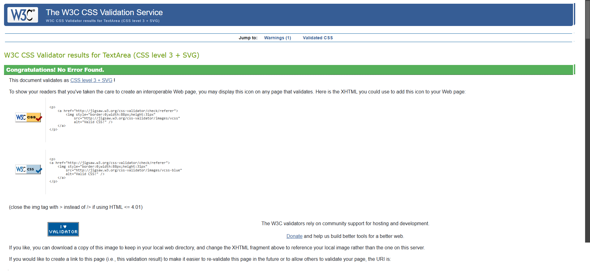
        | ✅ Pass   |
| 

mailchimp.css

               | ✅ Pass   |

### JavaScript

| File Name                                                                                                                                              | Result              |
| ---------------------------------------------------------------------------------------------------------------------------------------------------- | ------------------- |
| 

base.js

        | ✅ Pass   |
| 

Add Product Page

        | ✅ Pass   |
| 

Cart Page

        | ✅ Pass   |
| 

Products Page

        | ✅ Pass   |
| 

Profile Page

        | ✅ Pass   |
| 

quantity-input.js

        | ✅ Pass   |
| 

stripe-elements.js

        | ✅ Pass   |

### Python

All Python files were processed using the [CI Python Linter](https://pep8ci.herokuapp.com/), and no errors were found.

#### Blog app

| Python File                                                                                                                                               | Result              |
| ---------------------------------------------------------------------------------------------------------------------------------------------------- | ------------------- |
| 

admin.py

        | ✅ Pass   |
| 

apps.py

        | ✅ Pass   |
| 

forms.py

        | ✅ Pass   |
| 

models.py
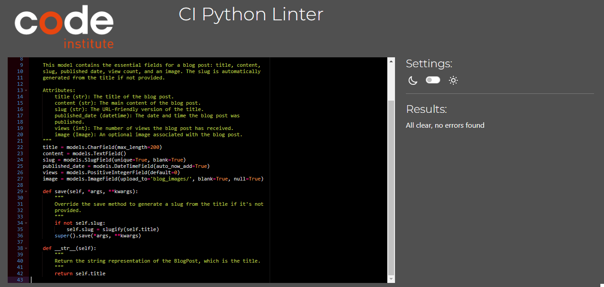
        | ✅ Pass   |
| 

urls.py

        | ✅ Pass   |
| 

views.py

        | ✅ Pass   |

#### Build Master

| Python File                                                                                                                                               | Result              |
| ---------------------------------------------------------------------------------------------------------------------------------------------------- | ------------------- |
| 

settings.py

        | ✅ Pass   |
| 

urls.py

        | ✅ Pass   |
| 

views.py

        | ✅ Pass   |
| 

wsgi.py

        | ✅ Pass   |

#### Cart app

| Python File                                                                                                                                               | Result              |
| ---------------------------------------------------------------------------------------------------------------------------------------------------- | ------------------- |
| 

apps.py

        | ✅ Pass   |
| 

cart_tool.py

        | ✅ Pass   |
| 

context-processors.py

        | ✅ Pass   |
| 

urls.py

        | ✅ Pass   |
| 

views.py

        | ✅ Pass   |

#### Checkout app

| Python File                                                                                                                                               | Result              |
| ---------------------------------------------------------------------------------------------------------------------------------------------------- | ------------------- |
| 

admin.py

        | ✅ Pass   |
| 

apps.py

        | ✅ Pass   |
| 

forms.py

        | ✅ Pass   |
| 

models.py

        | ✅ Pass   |
| 

signals.py

        | ✅ Pass   |
| 

urls.py

        | ✅ Pass   |
| 

views.py

        | ✅ Pass   |
| 

webhook_handler.py
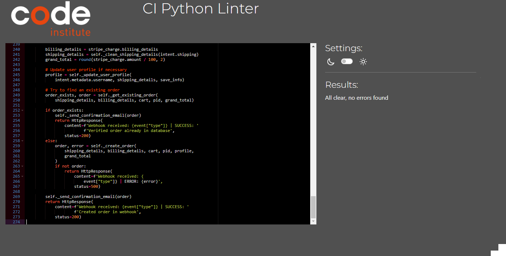
        | ✅ Pass   |
| 

webhooks

        | ✅ Pass   |

#### Home app

| Python File                                                                                                                                               | Result              |
| ---------------------------------------------------------------------------------------------------------------------------------------------------- | ------------------- |
| 

admin.py

        | ✅ Pass   |
| 

apps.py

        | ✅ Pass   |
| 

forms.py

        | ✅ Pass   |
| 

models.py

        | ✅ Pass   |
| 

urls.py

        | ✅ Pass   |
| 

views.py

        | ✅ Pass   |

#### Products app

| Python File                                                                                                                                               | Result              |
| ---------------------------------------------------------------------------------------------------------------------------------------------------- | ------------------- |
| 

admin.py

        | ✅ Pass   |
| 

apps.py

        | ✅ Pass   |
| 

custom_filters.py

        | ✅ Pass   |
| 

forms.py

        | ✅ Pass   |
| 

models.py

        | ✅ Pass   |
| 

urls.py

        | ✅ Pass   |
| 

views.py

        | ✅ Pass   |

#### Profiles app

| Python File                                                                                                                                               | Result              |
| ---------------------------------------------------------------------------------------------------------------------------------------------------- | ------------------- |
| 

admin.py
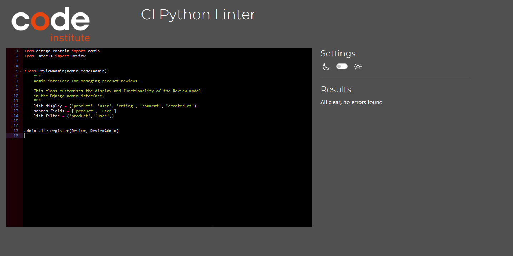
        | ✅ Pass   |
| 

apps.py

        | ✅ Pass   |
| 

forms.py

        | ✅ Pass   |
| 

models.py

        | ✅ Pass   |
| 

urls.py
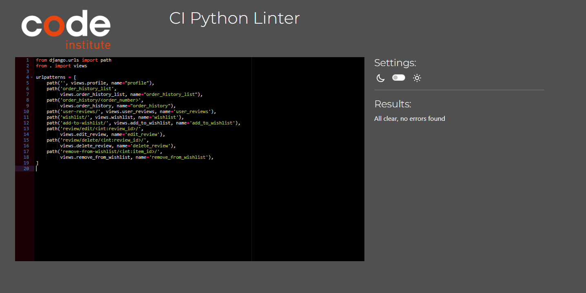
        | ✅ Pass   |
| 

views.py

        | ✅ Pass   |

[Back To Top](#table-of-contents)

## Responsiveness and Device Testing

Throughout the development process, the website was rigorously tested across a range of devices, including desktops, laptops, smartphones, and tablets. This testing ensured that the website displayed correctly on screens of various sizes and orientations, both portrait and landscape. Additionally, the responsive design was validated using Google Chrome's Developer Tools to confirm that the layout remained structurally sound and adaptable across different screen dimensions. No issues were noted, affirming that the site functions as expected across diverse environments.

[Back To Top](#table-of-contents)

## Browser Testing

The website was tested across Google Chrome, Safari, and Microsoft Edge, and no issues were found.

[Back To Top](#table-of-contents)

## Lighthouse Testing

Lighthouse validation was run on all pages (both mobile and desktop) in order to check performance, accessibility, best practices and CEO.

| Page            | Performance | Accessibility | Best Practices | SEO | Screenshot                                                                                                                  |
| --------------- | :---------: | :-----------: | :------------: | :-: | --------------------------------------------------------------------------------------------------------------------------- |
|                 |             |               |                |     |
| **Desktop**     |             |               |                |     |
| Home            |     96      |      100      |      100       | 100 | 

Home

                    |
| Products            |     86      |      100      |      100       | 100 | 

Products

                    |
| Product Detail            |     85      |      100      |      100       | 100 | 

Product Detail

                    |
| Cart            |     91      |      100      |      100       | 100 | 

Cart

                    |
| Checkout            |     83      |      93      |      78       | 100 | 

Checkout

                    |
| Checkout Success            |     84      |      100      |      100       | 100 | 

Checkout Success

    
| My Profile            |    95      |      96      |      100       | 100 | 

My Profile

                    |
| My Orders            |     92      |      100      |      100       | 100 | 

My Orders

                    |
| My Reviews            |     95      |      100      |      100       | 100 | 

My Reviews

                    |
| Edit Review            |     96      |      100      |      100       | 100 | 

Edit Review

                    |
| Delete Review            |     97      |      100      |      100       | 100 | 

Delete Review

                    |
| My Wishlist            |     93      |      100      |      100       | 100 | 

My Wishlist

                    |
| Add a Product            |     89      |      100      |      100       | 100 | 

Add a Product

                    |
| Edit a Product            |     86      |      100      |      100       | 100 | 

Edit a Product
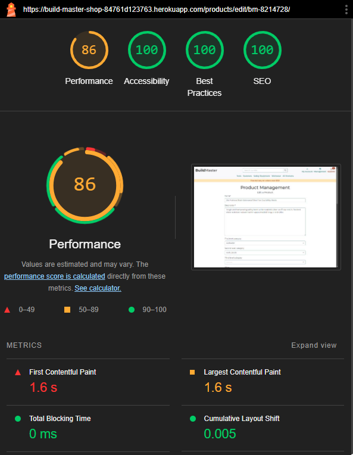
                    |
| Delete a Product            |     92      |      100      |      100       | 100 | 

Delete a Product

                    |
|Add a Post            |     96      |      100      |      100       | 100 | 

Add a Post 

                    |
| Edit a Post            |     96      |      100      |      100       | 100 | 

Edit a Post 

                    |
| Delete a Post            |     82      |      100      |      100       | 100 | 

Delete a Post

                    |
| All Posts            |     93      |      100      |      100       | 100 | 

All Posts

                    |
| Blog Post            |     89      |      100      |      100       | 100 | 

Blog Post

                    |
| Contact Us            |     97      |      100      |      100       | 100 | 

Contact Us

                    |
| Privacy Policy            |     91      |      96      |      100       | 100 | 

Privacy Policy

                    |
| Terms of Service            |     94      |      100      |      100       | 100 | 

Terms of Service

                    |                |
| Sign In            |     90      |      96      |      100       | 100 | 

Sign In

                    |
| Sign Up            |     95      |      96      |      100       | 100 | 

Sign Up

                    |
| Sign Out            |     95      |      100      |      100       | 100 | 

Sign Out

                    |
| Password Reset            |     97      |      100      |      100       | 100 | 

Password Reset

                    |
|                 |             |               |                |     |
| **Mobile**      |             |               |                |     |
| Home            |     90      |      100      |      100       | 100 | 

Home

                    |
| Products            |     85      |      100      |      100       | 100 | 

Products

                    |
| Product Detail            |     77      |      100      |      100       | 100 | 

Product Detail
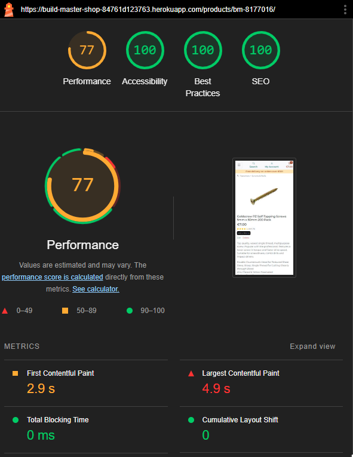
                    |
| Cart            |     90      |      100      |      100       | 100 | 

Cart
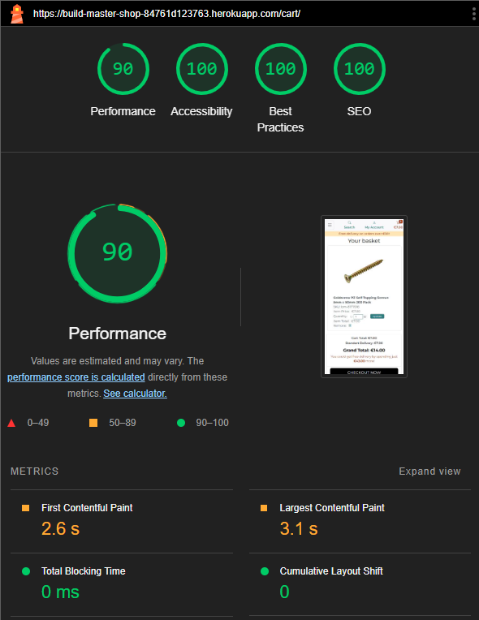
                    |
| Checkout            |     80      |      93      |      79       | 100 | 

Checkout

                    |
| Checkout Success            |     80      |      100      |      100       | 100 | 

Checkout Success

    
| My Profile            |     90      |      96      |      100       | 100 | 

My Profile

                    |
| My Orders            |     88      |      100      |      100       | 100 | 

My Orders

  
| My Reviews            |     89      |      100      |      100       | 100 | 

My Reviews

                    |
| Edit Review            |     90      |      100      |      100       | 100 | 

Edit Review

                    |
| Delete Review            |     90      |      100      |      100       | 100 | 

Delete Review

                    |
| My Wishlist            |     80      |      100      |      100       | 100 | 

My Wishlist

                    |
| Add a Product            |     84      |      100      |      100       | 100 | 

Add a Product

                    |
| Edit a Product            |     85      |      100      |      100       | 100 | 

Edit a Product

                    |
| Delete a Product            |     89      |      100      |      100       | 100 | 

Delete a Product

                    |
|Add a Post            |     85      |      100      |      100       | 100 | 

Add a Post 

                    |
| Edit a Post            |     83      |      96      |      100       | 100 | 

Edit a Post 

                    |
| Delete a Post            |     81      |      100      |      100       | 100 | 

Delete a Post

                    |
| All Posts            |     85      |      100      |      100       | 100 | 

All Posts

                    |
| Blog Post            |     90      |      100      |      100       | 100 | 

Blog Post

                    |
| Contact Us            |     88      |      100      |      100       | 100 | 

Contact Us

                    |
| Privacy Policy            |     82      |      96      |      100       | 100 | 

Privacy Policy

                    |
| Terms of Service            |     87      |      100      |      100       | 100 | 

Terms of Service

                    |                |
| Sign In            |     81      |      96      |      100       | 100 | 

Sign In

                    |
| Sign Up            |     91      |      96      |      100       | 100 | 

Sign Up

                    |
| Sign Out            |     89      |      100      |      100       | 100 | 

Sign Out
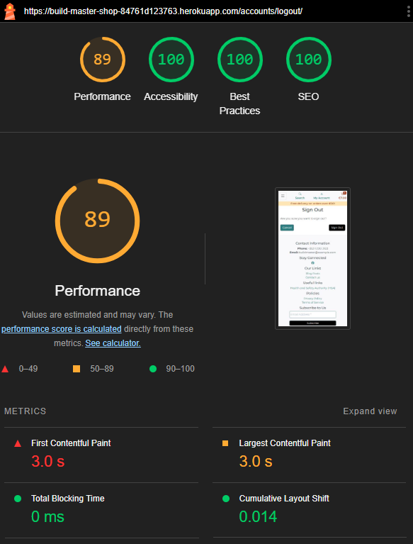
                    |
| Password Reset            |     91      |      100      |      100       | 100 | 

Password Reset

                    |

[Back To Top](#table-of-contents)

## User Story Testing

| User Story                                                                                                                                                                                                                        | Screenshot                                                                                                                                                                                              | 
| --------------------------------------------------------------------------------------------------------------------------------------------------------------------------------------------------------------------------------- | ------------------------------------------------------------------------------------------------------------------------------------------------------------------------------------------------------- | 
| As a new user I want to register on the website so that I can make purchases.  |                                                                                                                                                                     | 
| As a newly registered user I can verify my email address, so that I can complete my registration and access my account.  |                                                                                                                                                            | 
| As a registered user I want to log in to my account so that I can access my profile and purchase products.  |                                                                                                                                                                  | 
| As a registered user I want to manage my profile details (name, email, address, etc.) so that I can update my personal information.  |                                                                                                                                                                     | 
| As a user who has forgotten their password, I can be able to reset my password, so that I can regain access to my account.  |                                                                                                                                                                  | 
| As a user I want to browse all products by categories and subcategories so that I can find the products I’m looking for.  |                                                                                                                                                            |
| As a user I want to view detailed information about a product so that I can decide if I want to buy it.  | 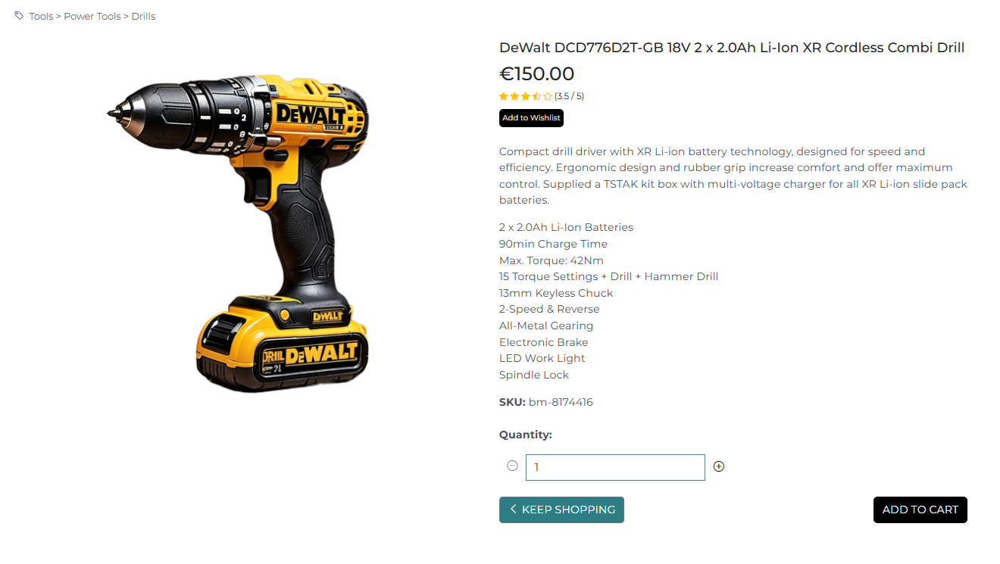                                                                                                                                                                   | 
| As a superuser I want to add new products on the website so that I can manage the inventory outside of the admin panel.  |                                                                                                                                                                  | 
| As a superuser I want to edit products on the website so that I can update product information outside of the admin panel.  |                                                                                                                                                                | 
| As a superuser I want to delete products from the website so that I can remove products that are no longer available.  |                                                                                                                                                      |
| As an admin I want to manage products via the Django admin panel so that I can add, edit, and delete products more efficiently.  |                                                                                                                                                                    | 
| As a user I want to add products to my cart so that I can purchase them later.  | 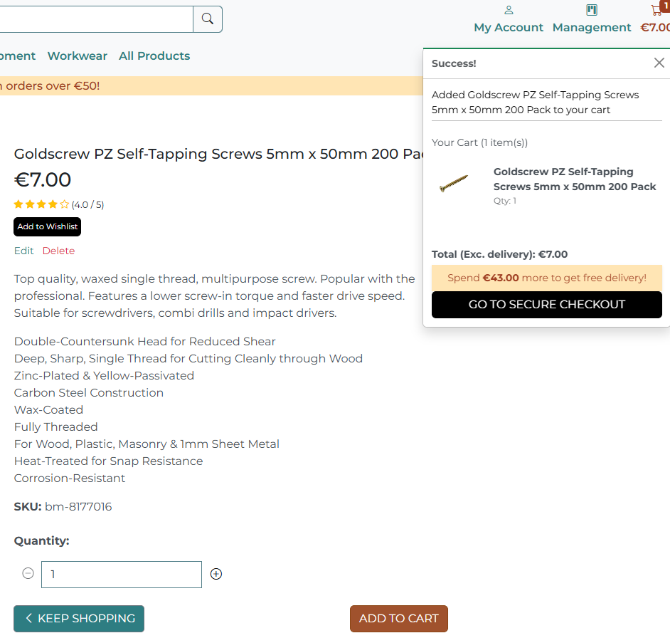                                                                                                                                                                    | 
| As a user I want to view the contents of my cart so that I can review my order before checkout.  |                                                                                                                                                                    | 
| As a user I want to proceed to checkout and place my order so that I can buy products.  |                                                                                                                                                                 | 
| As a registered user I want to view my past orders so that I can track and manage my previous purchases.  |                                                                                                                                                                      | 
| As a registered user I want to leave a review and rating for a product so that I can share my experience with others.  |                                                                                                                                                                | 
| As a registered user I want to edit or delete my review so that I can update my feedback if needed.  |                                                                                                                                                                    | 
| As a user I want to pay for my order using Stripe so that I can complete my purchase securely.  |                                                                                                                                                                  | 
| As a user I want to contact customer support so that I can get help with any issues or questions regarding products and my orders  |                                                                                                                                                                      | 
| As a site owner I want to store customer support form in the database so that I can review them  |                                                                                                                                                                      |
| As a site owner I want to mark user requests as "read" so that I can see how many I still need to process  |                                                                                                                                                                      |
| As a user I want to subscribe to the newsletter by entering my email so that I can receive updates and promotions.  |                                                                                                                                                                      |
| As a customer I want to search for tools and clothing easily so that I can find the products I'm looking for without browsing the entire website.  |                                                                                                                                                                      |

[Back To Top](#table-of-contents)

## Bugs

All known bugs and issues have been thoroughly addressed and resolved. The application is currently functioning as intended, with no outstanding errors reported.

[Back To Top](#table-of-contents)